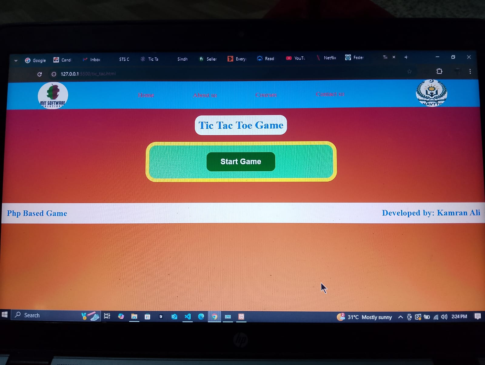

# 🎮 Tic Tac Toe Game (PHP)

A simple **Tic Tac Toe Game** built using **PHP** and HTML/CSS.

## 🚀 Features
- Player (X) vs Computer (O)
- Computer plays random moves
- Checks winner (rows, columns, diagonals)
- Shows Draw when board is full
- Restart option
- Simple clean UI

## 🛠️ Installation
1. Install [XAMPP](https://www.apachefriends.org/) or any PHP server.
2. Copy project folder into `htdocs` directory.
3. Start **Apache** server.
4. Open browser and go to:

## 🖼️ Screenshot

## 👨‍💻 Author
- **Kamran Ali**
- Full Stack Development Student
